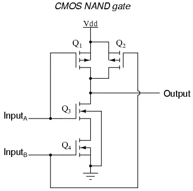
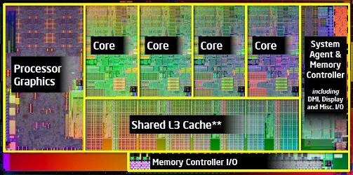

# CPU


* **Transistoren** sind schnelle elektronische Schalter, die elektrische Ströme ein- und ausschalten können.
* Wenn man mehrere Transistoren verknüpft, kann man logische, binäre Operationen ausführen.  
* Ein **CMOS NAND Gate** besteht z.B. aus 4 Transistoren.

* Das menschliche Gehirn bei einer Masse von anderthalb Kilogramm aus fast **neunzig Milliarden Nervenzellen**
* Im Hirn hat es bis zu 1 Trilliarde Verbindungen


| A | B | AND | NAND | XOR | Exclusive-NOR |
| :--- | :--- | :--- | :--- | :--- | :--- |
| 0 | 0 | 0 | 1 | 0 | 1 |
| 0 | 1 | 0 | 1 | 1 | 0 |
| 1 | 0 | 0 | 1 | 1 | 0 |
| 1 | 1 | 1 | 0 | 0 | 1 |

## Von-Neumann-Rechner

* Universalrechner

#### Räumliche Trennung

* Rechenwerk
* Speicherwerk
* Steuerwerk
* i/O \(Kommunikation\)

## Heutige Rechner

Die heutigen CPU bestehen aus vier Funktionsgruppen \(Units\)

<table>
  <thead>
    <tr>
      <th style="text-align:left"></th>
      <th style="text-align:left"></th>
      <th style="text-align:left"></th>
    </tr>
  </thead>
  <tbody>
    <tr>
      <td style="text-align:left"><b>CU (Control Unit)</b>
      </td>
      <td style="text-align:left">Steuerwerk, Leitwerk</td>
      <td style="text-align:left">
        
Interpretiert Programme und Steuert &#xFC;ber das

        
Rechenwerk den Registersatz.

      </td>
    </tr>
    <tr>
      <td style="text-align:left"><b>ALU (Arithemtic Logical Unit)</b>
      </td>
      <td style="text-align:left">Rechenwerk</td>
      <td style="text-align:left">
        
Arithmetisch&#x2010;logische Einheit: Sie ist zust&#xE4;ndig f&#xFC;r
          die Ausf&#xFC;hrung arithmetischer
           
        

        
(Addition, Subtraktion, Multiplikation, Division) und logischer Rechenoperationen
           
        

        
(UND, ODER, NICHT).

      </td>
    </tr>
    <tr>
      <td style="text-align:left"><b>Registersatz</b>
      </td>
      <td style="text-align:left"></td>
      <td style="text-align:left">
        
Speichert den aktuell auszuf&#xFC;hrenden Befehl und die dazugeh&#xF6;rigen
          wichtigen

        
Daten

      </td>
    </tr>
    <tr>
      <td style="text-align:left"><b>Mikroprogramm</b>
      </td>
      <td style="text-align:left"></td>
      <td style="text-align:left">
        
Setzt den Operationscode im Befehl in die einzelnen Ausf&#xFC;hrungsschritte

        
und Durchschaltung im Rechenwerk um.

      </td>
    </tr>
  </tbody>
</table>

#### Innerhalb der CPU werden Caches und Speichercontroller verwendet

| **Caches** | **Speichercontroller** |
| :--- | :--- |
| L1 - L3 Schneller Speicher innerhalb der CPU | Zur Ansteuerung des RAMs |

#### Ausserhalb des Prozessors sind die folgenden beiden Funktionsgruppen:

<table>
  <thead>
    <tr>
      <th style="text-align:left">
        

        
<b>Arbeitsspeicher (Memory)</b>
        

      </th>
      <th style="text-align:left">
        

        
<b>Ein-/Ausgabewerk (I/O)</b>
        

      </th>
    </tr>
  </thead>
  <tbody>
    <tr>
      <td style="text-align:left">
        
Enth&#xE4;lt Programme und Daten, auch Random Access Memory

        
(RAM) genannt.

      </td>
      <td style="text-align:left">Verbindet die CPU mit den &#xFC;brigen Komponenten des PCs.</td>
    </tr>
  </tbody>
</table>## Kenngrössen

| Was | Aktuell | Typischer Wert |
| :--- | :--- | :--- |
| CPU-Takt | 4 | GHz |
| Front Side Bus | 1333 | MHz |
| Million Floating  Operations  per Second | 33 | GFLOPS |
| L3 Cache | 3 | MB |

## Architektur

* **CISC** \(Complex Instruction Set Computing\): umfassenden Befehlssatz. 
  * Intel, AMD
  * PC's, Laptops
* **RISC** \(Reduced Instruction Set Computing\): kleinen Befehlssatz.
  * ARM
  * Smartphones

## Befehlsverarbeitung/Pipelining

Die Befehlsausführung in einer CPU kann in mehrere Abschnitte unterteilt werden: 

* Ein Befehl wird geladen. \(1\)
* Der Befehl wird decodiert. \(2\) 
* Die erforderlichen Daten \(Operanden\) werden geladen. \(3\) 
* Die im Befehl beschriebene Operation wird ausgeführt. \(4\)
* Die Ergebnisse werden zurückgespeichert. \(5\)

Jeder dieser fünf Abschnitte wird in der Von‐Neumann‐Architektur nacheinander in einem einzelnen Taktzyklus von der CPU ausgeführt. Damit sind im einfachsten Fall für die Ausführung eines kompletten Befehls **fünf** Taktzyklen erforderlich.

Beim Pipelining kann wenn der erste Befehl decodiert \(2\) wird. Bereits ein neuer Befehl geladen werden \(1\).

#### Befehlsdecoder

<table>
  <thead>
    <tr>
      <th style="text-align:left">Eingabe</th>
      <th style="text-align:left">x86 Befehlssatz</th>
      <th style="text-align:left"></th>
    </tr>
  </thead>
  <tbody>
    <tr>
      <td style="text-align:left">
        
01101110

        
11010100

        
01101010

      </td>
      <td style="text-align:left">
        
ADD

        
INT

        
MOV

      </td>
      <td style="text-align:left">
        
Rechnet 2 Zahlen zusammen

        
Prozess unterbrechen

        
Verschieben

      </td>
    </tr>
  </tbody>
</table>## Techonologien

* **Multicore \(Mehrkern-\) Prozessor** Aktuelle Prozessoren enthalten mehrere Prozessorkerne, dies Beschleunigt die Verarbeitung von Datenströmen. Um die volle Leistung anzusprechen muss die Software richtig Programmiert werden.
* **Hyper-Threading-Prozessor \(HT\)** Viele CISC-Prozessoren haben Rechenwerk und Steuerwerk zweifach in einem Prozessorkern. Durch das HT wird dem PC vorgegaukelt, dass ein zweiter Prozessor vorhanden ist. 
* **Superskalarer Prozessor** \(mehrere Befehle pro Takt\) Alle modernen Prozessoren arbeiten Superskalar. Unter Superskalarität versteht man die Eigenschaft eines Prozessors, mehrere Befehle gleichzeitig durch dynamische Zuteilung an parallel arbeitende Funktionseinheiten übergeben zu können.

## Performance

Zur Steigerung der Performance kann man folgendes machen:

* Bus vergrössern
* Grösseren CPU-Takt
* Höherer CPU-Bustakt
* Höhere Registerzahl
* Bessere Herstellertechnologie
* Hyperthreading
* Multi-Core-Processing

## Bilder

## Videos



