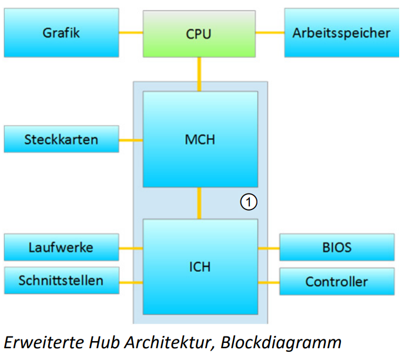
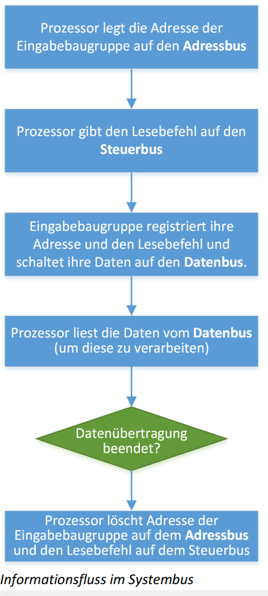
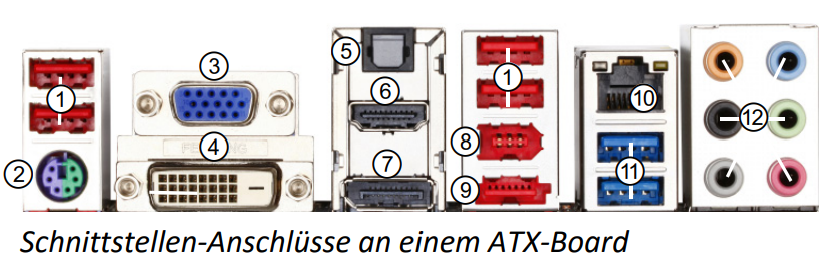
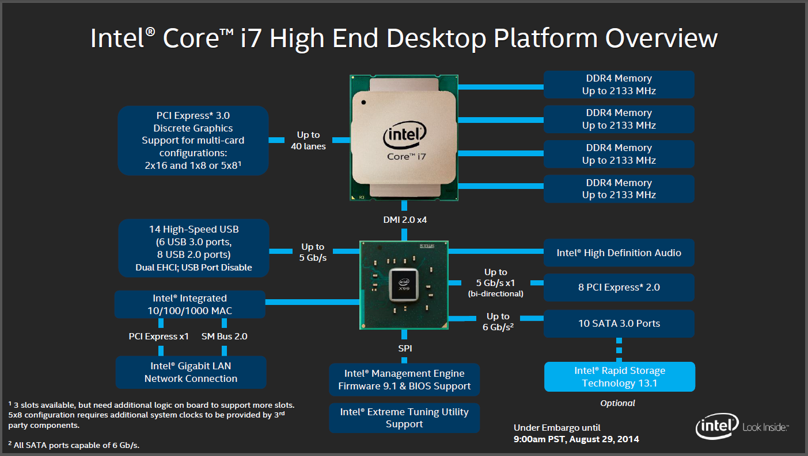

# Mainboard Komponenten

Ein wesentliches Grundelement des Personal Computers ist die **Hauptplatine**, auch **Motherboard** oder Main‐ board genannt. Im Regelfall besteht das Motherboard aus einer Trägerplatte aus Kunstharz, Fiberglas oder Carbon und wird als **Platine** bezeichnet. Die Platine enthält in mehreren Schichten elektrische Leiterbahnen aus leitfähigen Metallen wie Kupfer, Silber oder Gold. Über diese Leiterbahnen werden sämtliche Chipsatzbestand‐ teile, Erweiterungssteckplätze \(Slots\), Steuergeräte \(Controller\) und Schnittstellen miteinander verbunden. Auf modernen Motherboards sind viele Controller im Chipsatz oder Mikroprozessor integriert und somit nicht mehr auf dem Motherboard zu finden.

#### Aufgaben

* Verteilung der Spannungsversorgung
* Leiterbahnen für Kontrollsignale und Daten
* Sockel, Steckplätze und Schnittstellen


Oft sind heute auf Mainboards bereits wichtige Funktionen wie Sound, Ethernet usw. enthalten.


## Formfaktoren

* Mini-ATX
* Micro-ATX
* ATX

## Sockel für die CPU

Der Prozessorsockel stellt einen Steckverbinder dar, der einen Mikroprozessor \(auch als CPU – Central Processing Unit – oder nur Prozessor bezeichnet\) aufnimmt. Das Einsetzen des Prozessors erfolgt ohne Kraftaufwand.

Oft benötigt jeder neue Prozessortyp eine höhere und anders angeordnete Anzahl an Kontaktstiften \(Pins\), wodurch auch jeweils ein **eigener** Sockeltyp erforderlich wird.



## PCH

* Platform Controller Hub

Seit den 2000er Jahren ist die Northbridge als separater Chip auf dem Rückzug: Prozessoren wie der AMD Athlon 64 oder der Intel Core i7 integrieren aus Geschwindigkeitsgründen bereits einige oder alle Teile einer Northbridge, wodurch ein separater Chip nicht mehr notwendig ist.

#### Erweiterte Hub-Architektur

Wegen wachsender Leistungsansprüche entstand die erweiterte Hub‐Architektur. Grafik‐ und Speichercontroller befinden sich innerhalb der CPU. Das ermöglicht eine optimale Geschwindigkeit im Datenaustausch zwischen diesen drei Komponenten. Memory Controller Hub \(MCH\) und I/O Controller Hub \(ICH\) teilen sich ein gemeinsames Gehäuse \(1\). Daher spricht man in diesem Zusammenhang auch von einen „Einchip“‐Chipsatz.

## BIOS

Im **BIOS‐Chip** sind die Programmroutinen untergebracht, die zum Starten des Computers und zum Erkennen und Ansprechen der elementaren Hardware notwendig sind. Die Software, die in diesen Chip programmiert ist, kann bei Bedarf durch eine neuere Version aktualisiert werden, BIOS‐Update oder „Flashen“ des BIOS genannt.

* BIOS
  * Firmware
  * Basic Input / Output System
* UEFI
  * Neues, schlankeres BIOS
  * Frühere Übergabe an das OS

#### ROM

* ROM - Vom Hersteller vorprogrammiert
* PROM - Einmalig Programmierbar
* EPROM - Lässt sich mit UV-Licht löschen
* EEPROM - Elektronisch löschbar

## Hilfskomponenten

* Schwingquartz
  * Taktgeber
* Batterie
  * Systemuhr 
  * Systemeinstellungen speichern
* Spannungswandler
  * Aufsplittung der 12V

## RAM



## PCI

* Kontroller für
  * USB
  * FireWire
  * RAID
* Soundkarte

## PCI-Express

* z.B. Grafikkarten
* M2



## USB

* Maus
* Drucker
* Headset
* ..

USB 3.1 ^ 10Gbit/s

## IDE / S-ATA

* Festplatten
* Blu-Ray

## M.2

Der M.2-Standard beschreibt Varianten mit bis zu vier PCI-Express-Lanes, einem SATA Revision 3.x \(6 Gbit/s\) und/oder einem USB-3.0-Port – alles über einen Anschluss. Damit kann man sowohl PCI-Express als auch SATA-Speicher per M.2 anschließen. \(Wikipedia\)

Beispiel \(2019\):

| Eigenschaft | Wert |
| :--- | :--- |
| Leserate | 3470 MB/s |
| Kosten | 220.- |
| Grösse | 1000 GB |

## Jumper und DIP-Schalter

Damit können auf dem Mainboard Einstellungen vorgenommen werden.

## PowerSupply



## BUS

Im PC kamen und kommen verschiedene Bussysteme zum Einsatz. Dabei geht der Trend von der Bustopologie weg, hin zu direkten Punkt‐zu‐Punkt‐Verbindungen zwischen den Geräten.

Das Bussystem verbindet Komponenten eines Personal Computers \(Prozessor, Controller, Arbeitsspeicher, Eingabe‐/Ausgabeports\) elektrisch miteinander, damit ein Austausch von Informationen stattfinden kann. Bussysteme sind als Bündel elektrischer Leitungen realisiert, an die alle betreffenden Baugruppen parallel angeschlossen sind.

Dieser Systembus umfasst mehrere Teilfunktionen, die jeweils eigenständige Aufgaben übernehmen:



Alle zur Verarbeitung anstehenden Daten gelangen über den Datenbus von Speicherbaugruppe und Peripherie‐ geräten zum Prozessor und umgekehrt.

Verwendet werden 8, 16, 32 oder 64 Datenleitungen.



Grundsätzlich kann zu jeder Zeit immer nur eine einzige Komponente Daten auf dem Datenbus übermitteln.



Der Steuerbus regelt den Informationsfluss auf dem Systembus. Der Prozessor gibt über diesen Bus bekannt, ob sich die per Adresse angesprochene Komponente als Empfänger oder als Absender von Daten verhalten soll.







## Externe Schnittstellen

1. USB 2.0
2. -
3. -
4. -
5. -
6. HDMI
7. DisplayPort
8. FireWire 400
9. eSATA
10. Ethernet
11. USB 3.0
12. Sound-Anschlüsse Analog



## Bilder

