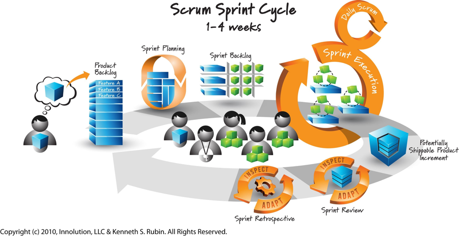

# Scrum - Level 1

## Rollen

### ProductOwner

* Bewahrt die Vision welche das Team erreichen will
* Repräsentiert den Kunden
* Verantwortlich für den Backlog
* Verantwortlich für die Stakeholder
* Motiviert das Team

### ScrumMaster

* Kennt Scrum und lebt dessen Prinzipien
* Vertritt das Team gegenüber dem Management
* Hilft dem Team
* Trainiert das Team
* Schützt das Team vor externen Störungen
* Sorgt dafür dass das Team die Scrum-Regeln befolgt
  * Coach des Scrum Teams
* Ist sachkundig

### Entwicklungsteam

* 5-9 Entwickler
* Gruppe von Menschen mit verschiedenen Fähigkeiten
* Folgt denselben Normen und Regeln
* Folgt einem gemeinsamen Ziel

## Aktivitäten

### Produkt-Backlog-Pflege

* Einfügen von Wünschen in den Backlog

### Sprint-Planung

* Der Product-Owner definiert das Sprint-Ziel
* Schätzen von Aufgaben
* Priorisieren von Aufgaben
* Verschieben von Aufgaben in den Sprint-Backlog
* Team trifft eine Vorhersage welche Aufgaben im nächsten Sprint erledigt werden können

### Daily Scrum

* Tägliches Stand-Up Meeting um zu erfahren wo Informationen fehlen oder Probleme aufgetaucht sind
* Alle Teammitglieder können nacheinander folgende Fragen beantworten
  * Was habe ich erreicht?
  * Woran möchte ich arbeiten?
  * Welche Probleme sind aufgetaucht?
* Viele Teams bevorzugen es, Probleme erst nach dem **Daily Scrum** zu besprechen/lösen

### Sprint-Ausführung

* Die Task werden abgearbeitet

### Sprint-Review

* Überprüfung der Arbeit mit dem Team und dem Kunden
* Wurde die beste Lösung gefunden?
* Die Richtung für den nächsten Sprint wird festgelegt 
* Ziele/Vorteile 
  * Kunden und Stakeholder sehen wie das Projekt voranschreitet und haben die Möglichkeit Einfluss zu nehmen 
  * Das Scrum-Team bekommt durch die häufigen Feedback ein besseres Verständnis von den Geschäftsprozessen des Kunden

### Sprint-Retrospektive

* Überprüfung der Arbeitsweise
* Stetige Verbesserung der Prozesses
* Nur das Scrum-Team mit dem Product-Owner und dem Scrum-Master
* Ziel: Ein effizientes Scrum-Team

## Artefakte

### Produkt Backlog

* Priorisierte Wunschliste mit Features und Verbesserungen
* Kann sich während dem Projekt ändern

### Sprint Backlog

* Tasks welche während eines Sprints zu erledigen sind
  * Nicht erfolgreich Erledigtes geht in den nächsten Sprint über

### Potentiell auslieferungsfähige Produktversion \(Done\)

* Potentiell lauffähiges Produkt welches dem Kunden ausgeliefert werden **kann** 
* Bedeutet nicht dass es dem Kunden ausgeliefert werden **muss** 
* Anhand folgender Kriterien wird entschieden ob das Produkt ausgeliefert wird 
  * Sind genügend Funktionen vorhanden um eine Auslieferung zu rechtfertigen 
  * Kann der Kunde eine weitere Auslieferung verkraften? 
  * Sind alle nötigen Tests ordnungsgemäss erledigt worden

