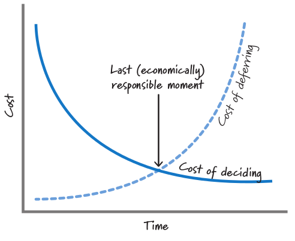

# Scrum - Level 2

## Unsicherheiten

* Unsicherheiten sollen identifiziert und behoben werden

## Entscheidungen sollten erst im letzten vernünftigen Moment getroffen werden

Wenn man Entscheidungen so spät als möglich trifft hat man folgende Vorteile:

* Man hat **weniger Unsicherheiten** da mehr Wissen zum Projekt da ist
  * Wahrscheinlichkeit dass man eine falsche Entscheidung trifft ist **kleiner**

## User Stories

* Eignen sich nicht für alle Backlog-Elemente welche ausgeführt werden sollen
  * "Als Kunde hätte ich gerne dass das System nicht die Datenbank beschädigt" wäre z.B. ein solcher Task welcher sich nicht gut als User-Story ausdrücken lässt
* Eignen sich gut um einen gewünschten Geschäftswert oder eine Business-Anforderung auszudrücken

#### User Story Vorlage

* Als &lt;Benutzerrolle&gt; möchte ich &lt;Ziel&gt;, so dass &lt;Vorteil&gt;

> Als **Wiki-Benutzer** möchte ich eine **Datei in das Wiki laden**, so dass ich sie mit meinen Kollegen teilen **kann**.

**Zufriedensheitsbedingungen**

Oft ist es sinnvoll zu einer User-Story einige Punkte zu definieren wann die Aufgabe als abgeschlossen gilt

> * Nur Dateien mit der Dateiendung jpg und png dürfen hochgeladen werden
> * Nur Dateien kleiner als 100 Megabyte dürfen hochgeladen werden
> * Nur wenn der User mehr als 39 Wiki-Punkte hat, darf er Dateien hochladen

#### Es lohnt sich in gute User-Stories Zeit zu investieren

Folgende Kriterien sollte eine User-Story erfüllen

* Independent
  * Stories sollten nicht von zu vielen Stories abhängig sein
* Negotiable
  * Stories sind keine Verträge, sie dienen vielmehr als Grundlage für Gespräche
  * Bei Stories geht es um das WAS und WARUM, nicht um das WIE
* Valuable
  * Wenn eine Story weder für den Kunden noch für den Anwender von Wert ist - so gehört sie nicht in den Backlog
* Estimatable
  * Sollte ein Team eine Story nicht schätzen können, dann ist die Story zu gross oder es gibt zu viele unbekannte Faktoren.
* Small
  * 

