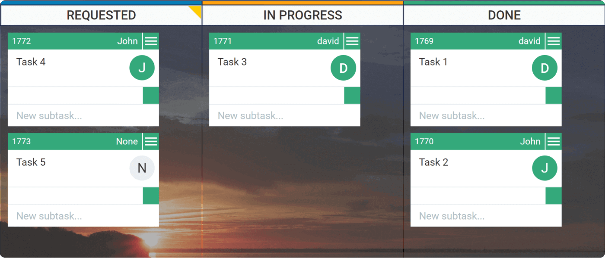

# Weitere Agile Projektmethoden


Die folgenden Techniken werden nicht im Detail angeschaut, trotzdem haben sie einige interessante Denkansätze.


## Lean Development



#### Lean Principles:

* **Eliminate waste** 
  * Halbfertige Arbeiten sind unnütz
  * Ständiger wechsel zwischen Aufgaben kostet Zeit
  * Störungen eliminieren
  * Ineffektive Kommunikation vermeiden
  * Entwicklung falscher Features oder Produkte
* **Amplify learning**
  * Anstelle von detaillierter Planung: Benutzerfeedback durch Demo
  * Automatisiertes Testen
* **Decide as late as possible**
  * Nicht auf Annahmen basierend arbeiten
  * Entscheidungen hinauszögern bis Fakten verfügbar sind
* **Deliver as fast as possible**
  * Nicht der Grösste überlebt sondern der Schnellste
  * Kunden schätzen schnelle Abgabe eines Qualitäts-Produktes
    * Entsteht durch korrektes Vorgehen - nicht durch Stress und Überarbeitung
* **Empower the team**
  * Flache Hierarchie
  * Manager werden geschult den Entwicklern zu zu hören
  * Leute sind nicht bloss Ressourcen
    * Brauchen Motivation und Zweck
* **Build integrity in**
  * Problemumfang verstehen und gesamthaft angehen, nicht sequentiell
    * Arbeiten in Stücken im Kontext des Gesamten Projekts
  * Kunde braucht Erfahrung mit dem System
* **See the whole**
  * Nicht nur Menge von Teilen

## eXtreme Programming

eXtreme Programming \(XP\) besteht im zyklischen Vorgehen auf allen Ebenen: von der Programmierung über die tägliche Abstimmung im Entwicklerteam bis hin zum gemeinsamen Anforderungsmanagement mit dem Kunden.

* **Sekundentakt**: Das Programmieren in Paaren \(Pair-Programming\) führt dazu, dass sich die Entwickler ständig gegenseitig kontrollieren und auf Fehler oder umständliches Design aufmerksam machen. 
* **Minutentakt**: In XP wird testgetrieben entwickelt, die UNIT-Tests werden also vor dem Code geschrieben, so dass eine permanente Überprüfung des Codes stattfindet.
* **Stundentakt**: Neu entwickelte Komponenten werden mehrmals täglich in das lauffähige Gesamtsystem integriert \(Continuous Integration\). So lassen sich Fehler schneller finden – denn je später Fehler entdeckt werden, um so aufwändiger sind sie zu beheben.
* **Tagestakt**: In XP findet ein tägliches Treffen statt, auf dem das Entwicklungsteam kurz über den Projektfortschritt reflektiert und Fehlentwicklungen vermeidet. Weil das Treffen im Stehen stattfindet \(durch die mangelnde Bequemlichkeit werden die Teilnehmer zur Prägnanz „gezwungen“\), heißt es auch _Standup-Meeting._
* **Wochentakt**: XP legt größten Wert auf kurze Iterationszyklen von wenigen Wochen. So erhält der Kunde immer wieder lauffähige Systemversionen, um diese zu testen und seine fachlichen Anforderungen auf den neuesten Stand zu bringen. Es werden also nicht die Anforderungen umgesetzt, die zu Projektbeginn einmal definiert wurden, sondern entwickelt wird immer genau das, was in der aktuellen Situation den größten Geschäftswert für den Kunden erzielt. Deshalb werden in regelmäßigen Abständen neue _Iterationspläne_ erstellt.
* **Monatstakt**: Anders als in klassischen Projekten, in denen es nur ein großes Release am Ende der Projektlaufzeit gibt, werden in XP-Projekten regelmäßig – am besten monatlich – neue Releases produktiv gestellt. Durch die kurzen Releasezyklen kann sehr früh ein Teil-Geschäftswert generiert werden. XP-Projekte werden deshalb sehr viel früher selbstfinanzierend als klassische Projekte. In Abständen von wenigen Monaten werden daher aktuelle _Releasepläne_ erstellt, in denen die nächsten Iterationen festgehalten werden.

Quelle:



## Kanban



* Kanban ist bekannt für das Kanban-Board
* Kanban begrenzt die Anzahl Tasks welche in einer Spalte sein dürfen

