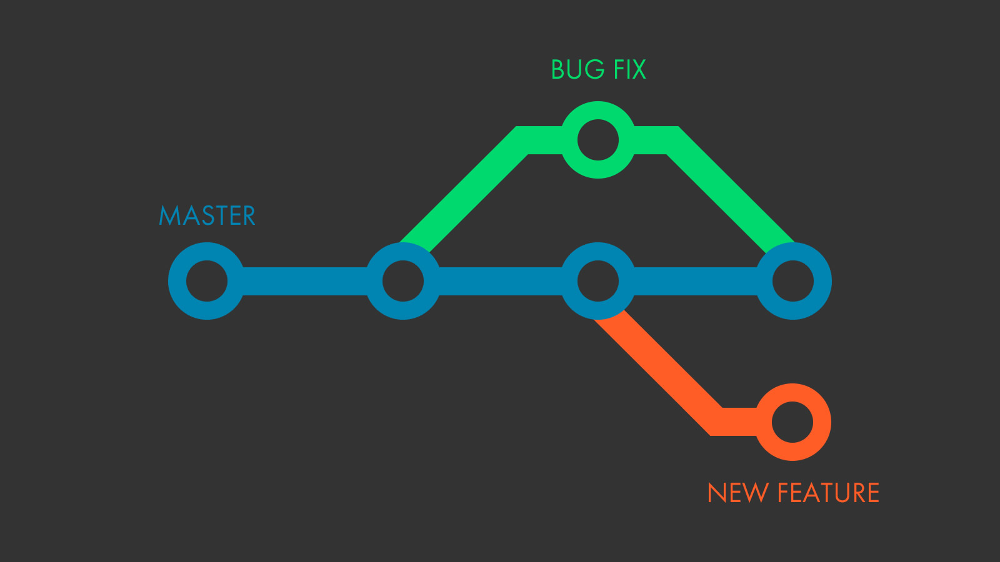

# Git - Level 1



## Starting a repo

#### Git remote with https

```text
git remote add origin git@git.assembla.com:portfolio/space.space_name.git
git remote -v
git remote show origin
```

#### Git clone

```text
git clone https://zzz.ch/moodle/moodle_block_exam_overview.git
```

#### Git clone with credentials

```text
git clone https://username@github.com/username/repository.git
```

## Autor des letzten `commits` ändern

```text
git ckacommit --amend --author="Christoph Karlen <christoph.karlen@ffhs.ch>"
```

#### Commit mit author

```text
git commit -m "message" --author="Christoph Karlen <christoph.karlen@ffhs.ch>"
```

## Tags

```text
# Show git tags
git describe --tags --abbrev=0
```


