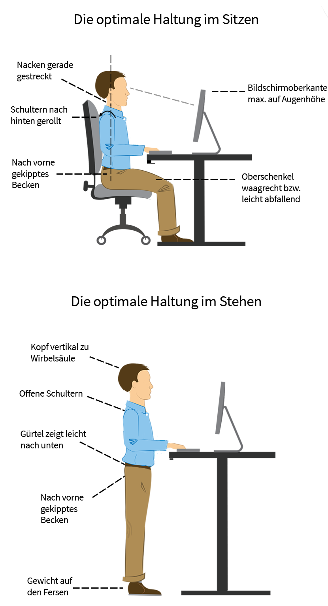

# Arbeitsplatz-Ergonomie

#### Bildschirm

* [ ] Keine **Reflexionen** am Bildschirm
* [ ] Den Bildschirm **gerade vor dem Kopf** platzieren
* [ ] Abstand halten \(Sehdistanz zum Bildschirm **60 bis 70 cm**\)
* [ ] Oberkante des Bildschirms etwa **5cm unter der Augenhöhe**
* [ ] **Grossen Monitor** nutzen

#### Büro-Tisch

* [ ] **Genügend Platz** für Tastatur, Maus und Beine
* [ ] **Verstellmöglichkeiten** ausnutzen \(Bildschirm, Tisch, Stuhl, Tastatur, ect\)
* [ ] Tischhöhe einstellen: **Unterarme waagrecht**
* [ ] **Stehpulte sind ideal -** nutzen falls möglich

**Stuhl**

* [ ] Dynamisch sitzen \(bewegliche **Rückenlehne mit Federkraft**
* [ ] Evtl. wegen Fussstützen nachfragen
* [ ] Bewegung: 60% dynamisches Sitzen; 30% Arbeiten im Stehen; 10% gezieltes Umhergehen
* [ ] Sitzen sie bequem

#### Beleuchtung

* [ ] Sorgen Sie für gute Beleuchtung
* [ ] Fenster zur Seite
  * [ ] Nicht vorne oder hinten
  * [ ] Keine Reflexionen

#### Ablenkung

* [ ] **Ordnung** halten!
  * [ ] Mindestens ein mal wöchentlich aufräumen
* [ ] Störquellen eliminieren
  * [ ] Smartphone
  * [ ] Mails \(Am Besten nur periodisch checken\)
  * [ ] Mit den Mitarbeitern fixe Zeiten für den Austausch vereinbaren

#### Sonstiges

* [ ] Musik kann die Leistung steigern
* [ ] Sport fördert die Durchblutung des Hirns
* [ ] Viel trinken
* [ ] Öfters Pausen machen \(Aufstehen, Strecken\)
* [ ] Regelmässig Lüften
* [ ] Pflanzen

#### Gesetzliche Grundlagen

Art. 3 der Verordnung 3 zum Arbeitsgesetz

> Der Arbeitgeber muss alle Massnahmen treffen, die nötig sind, um den Gesundheitsschutz zu wahren und zu verbessern und die physische und psychische Gesundheit der Arbeitnehmer zu gewährleisten

