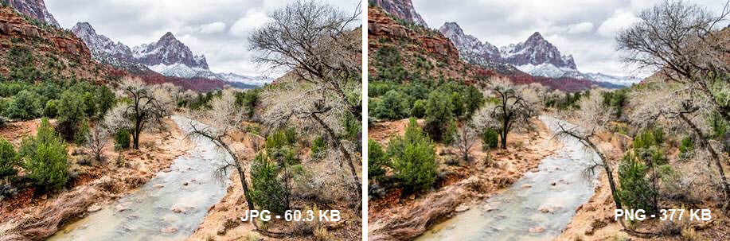

# Multimedia

## Kompressionsverfahren

| **verlustlos** | **verlustbehaftet** |
| :--- | :--- |
| RLE \(Run Length Encoding\) | JPEG |
| Zip, RAR, 7zip, gZip | Fraktale Kompression |

### RLE

* Sich wiederholende Abschnitte werden gezählt und nur einmalig gespeichert

AAABBCDDDD

3A 2B 1C 4D

## Bildformate

### JPEG

* Verlustbehaftet
* Für Fotos
* 300dpi \(Print\)
* ~~72dpi für Screen~~
  * dpi spielen für den Screen keine Rolle
  * Ein Bild muss z.B. 300px breit sein, um auf einer Homepage eine Fläche auszufüllen
  * Für Retina wäre dies 600px
    * Media Querys verwenden!

```css
@media
(-webkit-min-device-pixel-ratio: 2),
        /*retina stuff*/
}
```





### GIF

* "Ke~~i~~n Verlust"
* Weniger Farben
* Animation
* Transparenz
* Nur für Animationen verwenden

### Kompressionen

#### Fraktale Kompression

* Form Ähnlichkeiten
* z.B. für Scans
* "Traue keinem Scan den du nicht selbst gefälscht hast"

#### Wavelet-Kompression

* Kompression von Bildausschnitten mit verschiedenen Kompressionsalgorithmen

#### Pixelbild

* BMP
* TIFF \(CMYK\)

#### Vektorgrafik

* SVG
* EPS

#### PNG

* Ohne Verlust
* Transparenz

#### PDF

* Acrobat Portable Document Format

### Audio- und Videoformate

| **verlustlos** | **verlustbehaftet** |
| :--- | :--- |
| TrueHd | MP3, MP4 |

#### MP3

* Audio
* Es werden hohe und tiefe Frequenzen abgeschnitten
* bit rate
  * 128Kbps ~Radio
  * 160Kbps ~CD
  * 320Kbps ~Vinyl \(Audiophiles\)

### Videoformate

**MP4**

* Video

#### H264 / MPEG -4 AVC

* Dominierendes Format \(2016\)

#### Live-Streaming

* Multicast
* Twitch
* Bandwidth
  * 5Mbit/s for HD

#### On-demand-Streaming

* Unicast
* YouTube
* Netflix
* Spotify

YouTube und Netflix machen zusammen 50% des gesamten Internet-Traffics aus. \(USA\)

