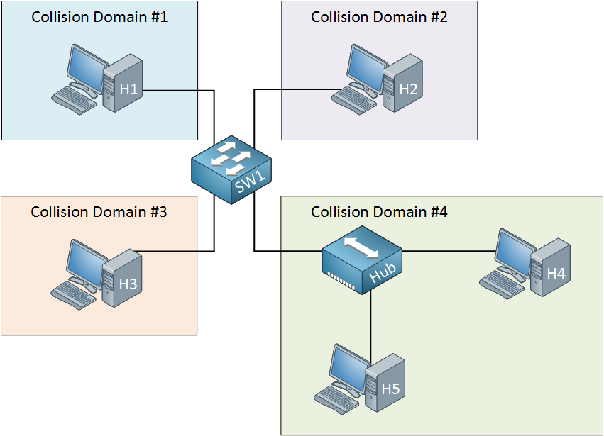

# Switch

* Trennt Collition Domains
* Vermittler, der Pakete anhand der im IP-Header enthaltenen Informationen von Ein- an Ausgänge weiterleitet
* Ein Switch kann mehrere Übertragungen gleichzeitig ausführen
* Weniger Kollisionen als ein Hub &gt; also schneller

> A **collision domain** is a network segment connected by a shared medium or through repeaters where simultaneous data transmissions collide with one another. The collision domain applies particularly in wireless networks, but also affected early versions of Ethernet. A network collision occurs when more than one device attempts to send a packet on a network segment at the same time. Members of a collision domain may be involved in collisions with one another. Devices outside the collision domain do not have collisions with those inside.

