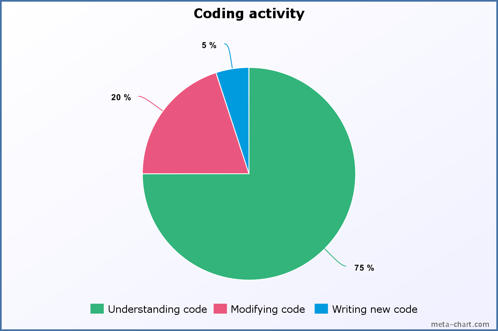

# CleanCode


Einige der definierten Regeln müssen **nicht** für alle Programmiersprachen gelten. Jede Programmiersprache hat ihre eigenen Regeln.


Ein durchschnittlicher Programmierer verbringt einen grossen Teil seiner Zeit mit dem **Verstehen** und **Anpassen** von existierenden Code.

Aus diesem Grund ist es wichtig, **eleganten** und leicht zu verstehenden Code zu schreiben.

Das Lesen von aussagekräftigen Code ist **einfach**. Das Schreiben von aussagekräftigen Code hingegen **schwierig**.

