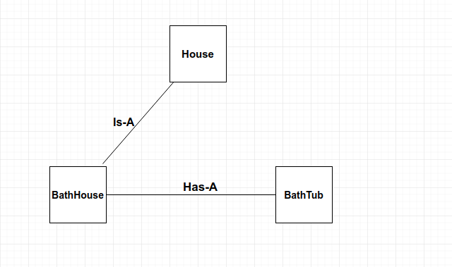

# Clean Code - Level 2

## Kommentare

#### Schlecht

```php
// This function runs a single check 
public function run($course, $checkname){

}
```

#### Besser

* Kommentare nur falls sich die Information nicht in `Methoden` oder `Variablennamen` unterbringen lassen.
* Kommentare brauchen Wartung
  * Falsche Kommentare sind irreführend

```php
public function runSingleCheck($course, $checkname){

}
```

#### Oft sind aber Kommentare notwendig

```php
/**
 * Get the plugin renderer for a specific check, if it doesn't exist, fallback to the default one.
 *
 * @param string $checkerName plugin name
 * @return GlobalPluginRenderer
 */
public function getRenderer($checkerName) {

}
```

## Boy Scout Rule \(Pfadfinderregel\)


Jedes Mal wenn du eine Zeile Code änderst, kontrolliere die umgebenden Zeilen und verbessere diese.


## Plugins


Schreibe ein Plugin möglichst so dass es auch mit anderen Frameworks funktionieren würde


## Code Style Guide

#### z.B. für PHP PSR4

```php
function getRenderer()    // camelCase Funktionen
{
    $checkerName;    // camelCase Variabeln
}


function test_get_renderer()
{ // Unit-Tests
    
}

// usw.
```

* Das Team muss sich für Style Guides entscheiden
* Die IDE kann Fehler erkennen

## Namespaces

* Namespaces dienen dazu dass Klassen mit demselben Namen in demselben Projekt möglich sind. Dies ist besonders wichtig wenn man Drittanbieter-Plugins verwendet.

```php
<?php
namespace Laravel\Lumen\Bus;
class PendingDispatch
{
    
}
```

## Naming Conventions


In einem Projekt lohnt es sich Namensconventionen zu definieren


`map-teachers-to-products`ist nicht dasselbe wie `map-products-to-teachers`

Unterschiede zwischen:

```text
link  
unlink
map 
sync
create 
save
update
delete 
destroy
```

#### **Verwende immer die gleichen Bezeichnungen für dasselbe Konzept**

z.B. `$product->save()` und `$category->store()` oder `$person->phoneNumbers->append()` und `$person->childern->add()`

## Keep it simple, stupid \(KISS\)

Für die Evolvierbarkeit des Codes ist zwingende Voraussetzung, dass der Code verständlich ist. Eine einfache, klare und leicht verständliche Lösung sollte daher immer bevorzugt werden. Wenn man seinen eigenen Code nach kurzer Zeit schon nicht mehr versteht, sollten die Alarmglocken klingen. Noch wichtiger aber ist, dass auch andere Entwickler den Code schnell verstehen können. Dabei helfen regelmäßige Reviews und Pair Programming. Sie dienen der Kontrolle, ob tatsächlich die einfachste Lösung verwendet wurde.

## Don´t Repeat Yourself \(DRY\)

Vermeide immer Code-Duplizierungen!

## Information Hiding Principle

Eine Klasse sollte nur die für die API notwendigen Methoden und Attribute öffentlich zur Verfügung stellen. Durch das Verbergen der Implementierungsdetails wird die Benutzung der Klasse von ihrer Implementierung unabhängig gemacht. Leider ist sehr häufig zu beobachten, daß alle in Klassen auf public gesetzt wird.

## Komposition an Stelle von Vererbung

Vererbungen sind nicht immer nötig und auch nicht so flexibel, wie eine Komposition. Daher sollte man genau schauen, ob nicht eine Komposition möglich ist.



#### Vererbung:

```php
// The parent’s class code
class House {
    protected $name;
    protected $size;
}

// The child can use the parent's class code
class BathHouse extends House {}

```

**Komposition:**

```php
class BathTub { }

class BathHouse {
    BathTub tub;
}
```

## Tell don't ask





